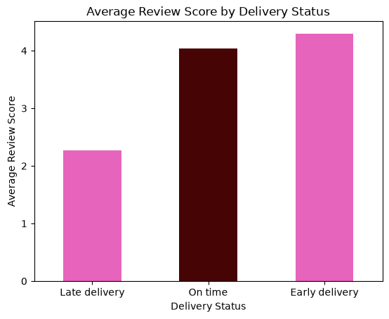
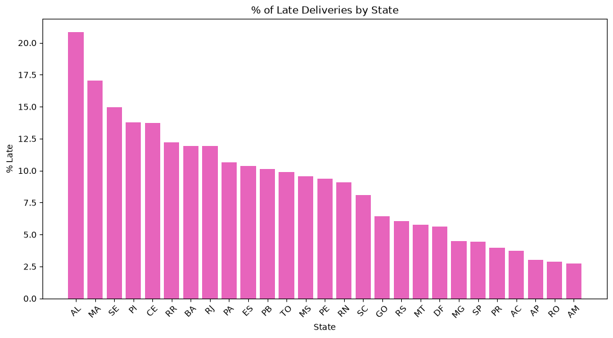

# Delivery Performance & Customer Satisfaction Analysis

**Business question:** Does late delivery hurt customer satisfaction — and if so, where is the problem worst?

This project analyzes the [Olist Brazilian E-Commerce dataset](https://www.kaggle.com/datasets/olistbr/brazilian-ecommerce) (100k+ real orders, 2016–2018) to find out whether delivery timing affects customer review scores, and identifies which states are most affected.

## Key Findings

1. **Late delivery significantly hurts customer satisfaction.** Orders delivered late average a **2.27** review score, compared to **4.03** for on-time and **4.29** for early deliveries — a nearly 2-point drop on a 5-point scale.

2. **Frequency of lateness matters more than average delay.** Looking at average delay per state was initially misleading — every state showed a *positive* (early) average delay, even the worst-performing ones. Switching to **% of orders delivered late** revealed the real pattern, since averages were hiding a smaller share of significantly late orders.

3. **The problem is regionally concentrated, not tied to order volume.** São Paulo (SP) — the highest-volume state by far (40,000+ orders) — has one of the *lowest* late-delivery rates (4.42%). Meanwhile, Alagoas (AL) and Maranhão (MA) show the worst rates at **20.85%** and **17.04%** respectively.

   *Note: states with very few total orders (RR, AC, AP — all under 300 orders) should be read cautiously, as small sample sizes make their percentages less statistically reliable.*

**Business recommendation:** Investigate logistics/fulfillment specifically in AL, MA, SE, CE, and PI — these are high-volume states with elevated late-delivery rates, representing the clearest opportunity to improve customer satisfaction through delivery improvements.

## Data Cleaning Notes

- Analysis is restricted to orders with `order_status = 'delivered'`, since undelivered orders have no real delivery date to measure.
- Of 2,965 orders with a missing delivery date, 8 were found mislabeled as "delivered" despite having no delivery date recorded — these were excluded from the analysis.

## Tools Used

- **MySQL** — data storage and querying (joins, aggregations, CASE logic)
- **Python** (pandas, sqlalchemy, matplotlib) — data loading and visualization
- **Jupyter Notebook** — analysis narrative and charts

## Repository Structure

```
├── README.md               — this file
├── olist_queries.sql        — table creation (DDL) and all analysis SQL queries
├── load_data.py             — script to load CSV data into MySQL tables
└── delivery_analysis.ipynb  — full analysis notebook with charts and findings
```

## How to Reproduce This Analysis

1. Download the dataset from [Kaggle](https://www.kaggle.com/datasets/olistbr/brazilian-ecommerce).
2. Run `olist_queries.sql` in MySQL to create the database schema (`olist_ecommerce`) and table structure.
3. Run `load_data.py` to load the CSV files into the created tables (you'll be prompted to enter your own local MySQL password).
4. Open `delivery_analysis.ipynb` and run all cells top to bottom (you'll be prompted for your MySQL password again when connecting).

## Charts




